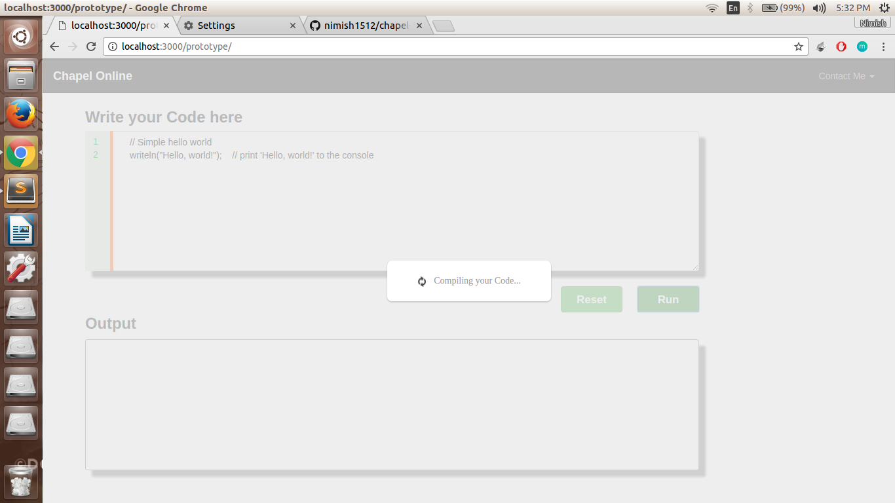
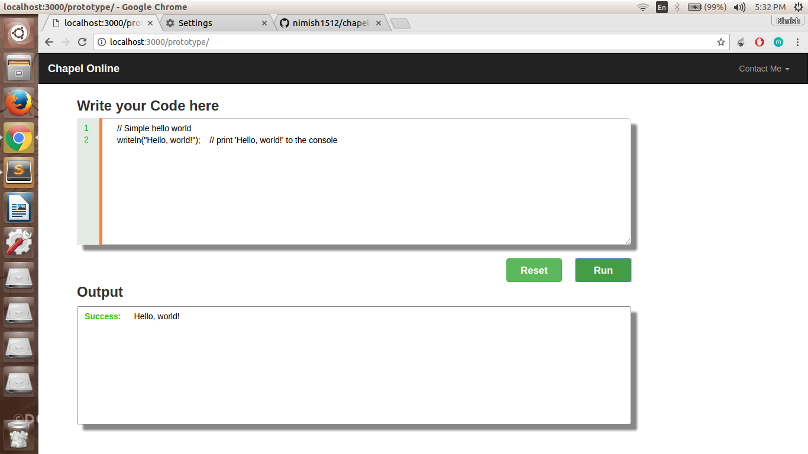

# Chapel-Online

GSOC 17 project prototype for Chapel(Web development Idea)

## Getting Started

These instructions will get you a copy of the project up and running on your local machine for development and testing purposes. See deployment for notes on how to deploy the project on a live system.

### Prerequisites

Things that you'll need :
```
sudo apt-get install apache2
sudo /etc/init.d/apache2 restart
Download and build chapel : http://chapel.cray.com/download.html
sudo apt-get install python3
sudo apt-get install php5 libapache2-mod-php5
```

### Installing

Steps to setup your working environment
```
git clone https://github.com/nimish1512/chapel-online.git

```
```
sudo mv chapel-online /var/www/
```
Providing necessary permissions (please take a backup of /etc/sudoers file before doing this)
```
sudo visudo
```
Append this at the end of the file. Replace USERNAME with your user_name
```
USERNAME ALL = NOPASSWD: /var/www/chapel-online/bash sch.sh
```
```
Hit Ctrl+x to save and exit
```
## Running the tests
Open up your favourite browser and type the following in url bar
```
localhost:80/chapel-online/
```
Demo
```
Landing Page
```

```
Compiling Page
```

```
Result Page
```


## Deployment

Additional notes about how to deploy this on a live system

## Built With

* [Bootstrap](http://getbootstrap.com/getting-started/) - Frontend framework 
* [PHP 5](https://maven.php.org/) - Restful API
* [Python 3.4](https://python.org) - Main controllers

## Authors

* **Nimish Ronghe** - *Initial work* - [Tensorflow](https://github.com/nimish1512)

## Acknowledgments

* Hat tip to anyone who's code was used
* Inspiration
* etc
